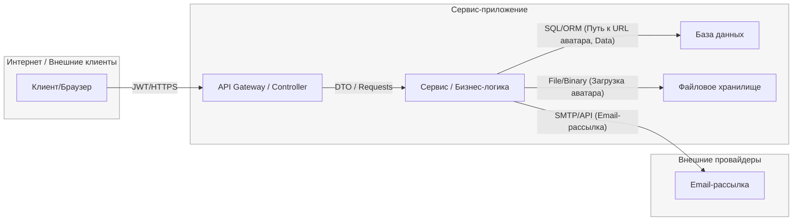

# TM - Требования безопасности + Модель угроз + ADR

## 1) Архитектура и границы доверия (TM1, S04)

- **Роли/активы:**
  - **Роли:** Неаутентифицированный пользователь (гость), Аутентифицированный пользователь.
  - **Активы:** ПДн пользователей (email, хеш пароля), сессионные JWT-токены.
- **Зоны доверия:** Internet (клиент, недоверенная зона), Service (приложение, доверенная зона), External (внешние провайдеры, условно-доверенные).
- **Context/DFD:**

- **Критичные интерфейсы и допущения:**
  - **Граница доверия:** Проходит по `API Gateway`. Все входящие из `Internet` запросы по умолчанию считаются недоверенными и должны проходить валидацию и аутентификацию/авторизацию.
  - **Допущения:**
    - Внутренние коммуникации между компонентами `Service` (Gateway → Logic, Logic → DB) считаются доверенными.
    - Внешний сервис `Email-рассылка` считается доверенным для отправки сообщений, но его доступность и безопасность не контролируются нами.
    - Хранилище `S3` настроено с приватными бакетами, доступ к которым имеет только `Сервис / Бизнес-логика`.
    - Административный доступ к компонентам в этой модели не рассматривается.

---

## 2) Реестр угроз STRIDE (TM2, TM3, S04)

| ID  | STRIDE | Компонент/поток        | Угроза (кратко)                                                      | L | I | L×I |
|-----|--------|------------------------|----------------------------------------------------------------------|---|---|-----|
| T01 | **S**  | U → A (JWT)            | Подмена личности украденным/повторно использованным JWT                | 4 | 5 | 20  |
| T02 | **T**  | A → S (DTO)            | Инъекции через невалидный ввод при регистрации/загрузке                | 3 | 5 | 15  |
| T03 | **R**  | S → D (SQL/ORM)        | Отказ от действий из-за отсутствия аудита операций записи              | 2 | 3 | 6   |
| T04 | **I**  | S (Logs)               | Раскрытие ПДн (email) в логах или ответах ошибок                     | 3 | 4 | 12  |
| T05 | **D**  | U → A (Public EPs)     | DoS из-за отсутствия rate-limit на регистрации/поиске                 | 4 | 3 | 12  |
| T06 | **E**  | S (JWT Logic)          | Повышение привилегий через редактирование JWT с ролями                 | 3 | 5 | 15  |
| T07 | **I**  | U → A (Register)       | **(Доменная)** Перебор аккаунтов (account enumeration) через API регистрации | 3 | 3 | 9   |

---

## 3) Приоритизация и Top-5 _(TM3, S04)_

1) **T01 Подмена личности (S)** - L×I=20; **Обоснование:** Критический риск, так как поверхность атаки (публичный API) широка, а импакт (полный доступ к данным пользователя) максимален. Распространенность атак на JWT высока.
2) **T02 Инъекции (T)** - L×I=15; **Обоснование:** Высокий импакт из-за возможности компрометации БД. Вероятность средняя, так как требует обхода валидации.
3) **T06 Повышение привилегий (E)** - L×I=15; **Обоснование:** Критический импакт (права администратора), но требует более сложных условий для эксплуатации (компрометация ключа или уязвимость в логике).
4) **T04 Раскрытие ПДн (I)** - L×I=12; **Обоснование:** Чувствительность данных (ПДн) и регуляторные риски (GDPR) повышают импакт. Вероятность зависит от качества маскирования и конфигурации логов.
5) **T05 DoS (D)** - L×I=12; **Обоснование:** Публичные эндпоинты регистрации и поиска легко подвержены автоматизированным атакам (флуд ботами), что делает угрозу высоковероятной.

---

## 4) Требования (S03) и ADR-решения (S05) под Top-5 (TM4)

### NFR-1. Аутентификация и защита токенов (T01, T06)
- **AC (GWT):**
  - **Given** валидный, но истекший Access Token и валидный Refresh Token, **When** запрос `/api/auth/refresh`, **Then** `200` и новая пара токенов.
  - **Given** JWT с поддельными ролями, **When** запрос к защищенному endpoint, **Then** `403 Forbidden`.

### NFR-2. Защита от инъекций и невалидного ввода (T02)
- **AC (GWT):** **Given** запрос на регистрацию с невалидным email или паролем, **When** `POST /api/auth/register`, **Then** `400 Bad Request` с деталями ошибки.

### NFR-3. Лимиты и таймауты (T05)
- **AC (GWT):** **Given** 5 регистраций с одного IP за 60 мин, **When** 6-я попытка, **Then** `429 Too Many Requests`.

### NFR-4. Защита ПДн (T04)
- **AC (GWT):** **Given** событие логируется с email, **When** оно записывается в лог, **Then** email маскируется как `***@domain.com`.

---

### Краткие ADR (минимум 2)

#### ADR-001 - JWT TTL, Refresh Token and Key Rotation
- **Context (угрозы/NFR):** T01, NFR-1; Компонент: `Auth Service`, `API Gateway`.
- **Decision:** Короткоживущие Access токены (15 мин), долгоживущие Refresh токены (7 дней) для обновления сессии. Ротация ключей подписи (JWKS).
- **Trade-offs:** (+): Значительное сокращение окна для атаки в случае кражи Access Token. (-): Усложнение логики на клиенте (обработка обновления токена), требуется хранилище отозванных Refresh токенов.
- **DoD:** Автотест: запрос с истекшим Access Token отклоняется (401), а `/api/auth/refresh` успешно возвращает новую пару токенов.
- **Owner:** backend-dev
- **Evidence (план):** `EVIDENCE/auth-tests.txt` (описание тестовых сценариев), `EVIDENCE/adr-001-diagram.png`

#### ADR-002 - Server-Side RBAC Enforcement
- **Context:** T06, NFR-1; Компонент: `Authorization Middleware`.
- **Decision:** Не хранить роли в JWT. Загружать роли из БД (с кэшированием) на стороне сервера по `user_id` из токена.
- **Trade-offs:** (+): Полное устранение риска повышения привилегий через JWT, мгновенное применение изменений прав. (-): Увеличение задержки (запрос к БД/кэшу), зависимость от доступности БД.
- **DoD:** Интеграционный тест: JWT с вручную добавленным полем `"roles": ["admin"]` не даёт доступа к защищенному эндпоинту (ожидается 403).
- **Owner:** backend-dev
- **Evidence (план):** `EVIDENCE/rbac-test.txt`, `EVIDENCE/middleware-code-snippet.txt`

#### ADR-003 - User Registration Input Validation
- **Context:** T02, NFR-2; Компонент: `Registration Service`.
- **Decision:** Строгая валидация на стороне сервера: email (RFC5322), пароль (сложность), ограничение полей запроса.
- **Trade-offs:** (+): Повышение безопасности учетных записей, снижение риска ошибок обработки. (-): Незначительное увеличение времени ответа на эндпоинте регистрации.
- **DoD:** Модульные тесты: запрос с невалидным email (`user@.com`) или слабым паролем (`password`) возвращает `400 Bad Request`.
- **Owner:** backend-dev
- **Evidence (план):** `EVIDENCE/validation-rules.json`, `EVIDENCE/validation-test.txt`

---

## 5) Трассировка Threat → NFR → ADR → (План)Проверки (TM5)

| Threat | NFR   | ADR     | Чем проверяем (план/факт)                                                               |
|-------:|-------|---------|-----------------------------------------------------------------------------------------|
| T01    | NFR-1 | ADR-001 | DAST-сценарий (см. `EVIDENCE/auth-tests.txt`), проверка логов на `auth.token_refreshed`    |
| T06    | NFR-1 | ADR-002 | Интеграционный тест `EVIDENCE/rbac-test.txt`, ревью кода `EVIDENCE/middleware-code-snippet.txt` |
| T02    | NFR-2 | ADR-003 | Unit-тесты валидации (см. `EVIDENCE/validation-test.txt`), SAST-отчёт `EVIDENCE/sast.json` |
| T05    | NFR-3 | -       | Нагрузочный тест (`k6 run load-test.js`), проверка логов на `rate_limit_hit`              |
| T04    | NFR-4 | -       | Просмотр образцов логов `EVIDENCE/audit-sample.log` на предмет маскирования ПДн        |

---

## 6) План проверок (мост в DV/DS)

- **SAST/Secrets/SCA:** `semgrep --config="p/default" . > EVIDENCE/sast-report.txt`; `gitleaks detect -v > EVIDENCE/secrets-report.txt`; `dependency-check ... > EVIDENCE/sca-report.html`
- **SBOM:** `cyclonedx-bom -o EVIDENCE/sbom.xml`
- **DAST (план):** Стенд `http://localhost:8080`; сценарии для `ZAP` или аналога для проверки флоу аутентификации (см. `EVIDENCE/auth-tests.txt`).
- **Примечание:** На этапе TM допустимы черновые планы/ссылки; финальные отчёты появятся в **DV/DS**.
